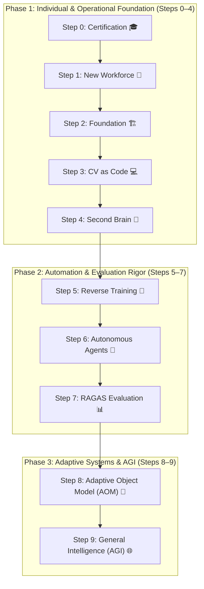

# 🧠 How We Reach AGI: Why Certification Is Step Zero

> **Author:** [Rifat Erdem Sahin (@Erdem)](https://www.linkedin.com/in/rifaterdemsahin/)  
> **Date:** September 25, 2026  
> **Domain:** Artificial General Intelligence · Systems Engineering · AI Governance  
> **Repository:** [rifaterdemsahin/whitepaper](https://github.com/rifaterdemsahin/whitepaper) · **Live Site:** [rifaterdemsahin.github.io/whitepaper](https://rifaterdemsahin.github.io/whitepaper/)

---

## 📌 Executive Summary

Artificial General Intelligence (**AGI**) is not reached in a single breakthrough. It is reached through a staged build-up of **verified capability** — moving from certified individual competence to certified organizational systems and, eventually, to adaptive machine systems that can absorb and extend that competence.

This white paper sets out a **ten-step roadmap (Step 0 through Step 9)** for that transition and argues that certification is not a formality bolted onto the front of the process. **It is the control mechanism that makes every later step trustworthy.**

> ⚠️ **Key Thesis:** Without a verified baseline at **Step 0**, none of the automation, agentic delegation, or adaptive systems built in later steps can be safely trusted, audited, or scaled.

---

## ⚡ Introduction: The AGI Transition Challenge

Most AI transformation efforts fail for the same recurring reason: **they start with tools instead of competence.** 

An organization or individual adopts a foundation model, an autonomous agent framework, or an automated pipeline before anyone has demonstrated they understand how the underlying system behaves, where it fails, or how it must be governed. The result:
- 🚫 **Fragile automation** that cannot be entrusted with production autonomy.
- 📉 **An unequipped workforce** unable to evaluate whether the AI's output is hallucinated or grounded.

The roadmap below solves this failure mode by treating AI transformation as a **dependency graph** rather than an arbitrary checklist. Each step only works because the step before it produced something verifiable:

```
[ Step 0: Certification ]
         │
         ▼
[ Steps 1-4: Human-AI Foundation ]
         │
         ▼
[ Steps 5-7: Automation & Evaluation Rigor ]
         │
         ▼
[ Steps 8-9: Adaptive Systems & AGI ]
```

Skipping a step does not save time; it merely moves the failure further downstream into mission-critical production systems that are substantially harder to unwind.

---

## 🗺️ The Ten-Step Roadmap

| Step | Name | Core Focus & What It Produces | Primary Output Artifact |
| :---: | :--- | :--- | :--- |
| **0** | **🎓 Certification** | Validated, frontier-lab-backed AI skills baseline | Verifiable credential / benchmark badge |
| **1** | **👥 New Workforce** | Human-AI collaboration operating model & mindset | Redefined team roles & workflows |
| **2** | **🏗️ Foundation** | AI infrastructure, compute fabrics, and data strategy | Scalable AI/ML runtime architecture |
| **3** | **💻 CV as Code** | Living, public resume and versioned track record | GitHub-backed public engineering history |
| **4** | **🧠 Second Brain** | Organized personal & organizational knowledge management | Structured PKM (Notion / Obsidian / Vector DB) |
| **5** | **🔄 Reverse Training** | Reverse-engineered, deconstructed, rebuilt systems | Deep conceptual & architectural understanding |
| **6** | **🤖 Agents** | Autonomous, multi-step task automation workflows | Deployed agentic swarms & stateful workers |
| **7** | **📊 RAGAS** | Retrieval and generation quality evaluation discipline | Groundedness, relevance & hallucination metrics |
| **8** | **🧩 AOM (Adaptive Object Model)** | Unified, runtime-adaptive core engine | Self-reconfiguring multi-agent runtime core |
| **9** | **🌐 AGI** | General problem-solving across open domains | Autonomous, safe, general intelligence |

---

## 🎯 Phase Breakdown

Read top-to-bottom, the roadmap divides into **three operational phases**:



---

## 🛡️ Why Certification Is Step 0

Certification is placed at the absolute foundation because it is the **only step in the roadmap that produces a third-party-verifiable claim**. 

Everything built after it — infrastructure, agents, evaluation pipelines, adaptive systems — is created and judged by humans. Those humans need a dependable signal of who actually understands the technology they are deploying:

1. 🔍 **Verifiability:** A badge from a frontier laboratory (*OpenAI, Anthropic, Google DeepMind, Meta AI*) is independently checkable by anyone — an employer, a client, an enterprise auditor, or a technical collaborator. Self-reported experience with prompt tools is not.
2. 🦺 **Safety & Alignment Discipline:** Certification curricula require passing rigorous safety and alignment modules alongside technical capability. A certified engineer has been tested on knowing **where automation must stop**, not just how fast to build it.
3. 🤝 **Common Baseline:** When a technical team or professional ecosystem operates on shared certification standards (e.g., the *CCAR-P* track), team members trust one another's competence without re-litigating fundamentals on every sprint.
4. 📈 **Signaling in a Commoditized Market:** As generative tools become commoditized, the market differentiator shifts from *"can invoke an AI prompt"* to *"can prove they understand model architectures, vulnerabilities, and limits."*
5. 🔁 **A Continuous Gate, Not a One-Time Trophy:** Because frontier AI moves rapidly, Step 0 functions as a **recurring practice** — continuously re-certifying against updated frontier curricula rather than resting on a legacy credential.

> 🚨 **Critical Risk:** Without this initial gate, every subsequent phase inherits unverified assumptions. An uncertified builder deploying autonomous agents (Step 6) has no external verification that they comprehend the cascading failure modes they are automating.

---

## 🏛️ Phase 1 (Steps 1–4): Building the Human-AI Foundation

Once individual competence is verified, it requires an environment to operate and a transparent medium to be evaluated:

* 👥 **Step 1: New Workforce** — Shifts organizational topology toward human-AI symbiosis. Teams cultivate high-agency mindsets that treat AI models as managed digital collaborators rather than threat surfaces or passive toys.
* 🏗️ **Step 2: Foundation** — Builds the physical and cloud infrastructure layer: compute resource scheduling, data governance, API gateway proxies, vector stores, and private execution sandboxes.
* 💻 **Step 3: CV as Code** — Transforms professional credibility from a stale PDF into a living, Git-versioned artifact: public commit histories, pull requests, open-source benchmarks, and real-time verifiable track records.
* 🧠 **Step 4: Second Brain** — Organizes collective and individual intelligence (via Obsidian, Notion, or structured vector stores) so that knowledge, decision rationale, and architecture blueprints are instantly retrievable rather than siloed in human memory.

---

## ⚙️ Phase 2 (Steps 5–7): Automation, Agents & Evaluation Rigor

With a verified foundation in place, the roadmap transitions from individual competence to **system autonomy**:

* 🔄 **Step 5: Reverse Training** — Deepens architectural mastery by deconstructing existing enterprise software, reverse-engineering protocols, and rebuilding them using modern AI-native techniques.
* 🤖 **Step 6: Agents** — Deploys autonomous, stateful agentic workflows capable of multi-step task execution, tool use, and self-correction — marking the first time AI acts outside of a continuous human-in-the-loop harness.
* 📊 **Step 7: RAGAS (Evaluation Discipline)** — Installs rigorous automated verification: *Retrieval-Augmented Generation Assessment*. Measures groundedness, context precision, context recall, and faithfulness.

> 💡 **The Value of Step 0 in Phase 2:** A certified engineer is grounded in safety alignment and will never release autonomous agents into production without Step 7's evaluation firewall in place.

---

## 🚀 Phase 3 (Steps 8–9): Adaptive Systems & AGI

The terminal phase unifies isolated workflows into a coherent, general-purpose intelligence architecture:

* 🧩 **Step 8: AOM (Adaptive Object Model)** — Replaces brittle hardcoded scripts with a unified, runtime-adaptive architecture. The system models domain entities, workflows, and tools dynamically, allowing runtime reconfiguration as operating conditions shift.
* 🌐 **Step 9: AGI (Artificial General Intelligence)** — High-level problem solving across disparate domains. Systems built on an adaptive core, secured through continuous evaluation, and anchored by certified human oversight.

---

## 🏁 Conclusion

Reaching AGI is primarily an **engineering and governance problem**, not a singular lab research miracle. Each of the ten steps depends unconditionally on the integrity of the step before it:

$$\text{Step 0 (Certified Competence)} \longrightarrow \text{Step 7 (Evaluated Autonomy)} \longrightarrow \text{Step 8 (Adaptive Core)} \longrightarrow \text{Step 9 (AGI)}$$

Certification matters because it is the **only checkpoint in the entire roadmap that a third party can independently confirm**.

---

## 📬 Connect & Collaborate

* 💼 **LinkedIn:** [@rifaterdemsahin](https://www.linkedin.com/in/rifaterdemsahin/)
* 🌐 **Website:** [rifaterdemsahin.com](https://www.rifaterdemsahin.com)
* 🐙 **GitHub:** [rifaterdemsahin](https://github.com/rifaterdemsahin)
* 📺 **YouTube:** [@RifatErdemSahin](https://www.youtube.com/@RifatErdemSahin)
* 🐦 **X (Twitter):** [@rifaterdemsahin](https://x.com/rifaterdemsahin)

---
*© 2026 Rifat Erdem Sahin. Released under open technical research documentation.*
